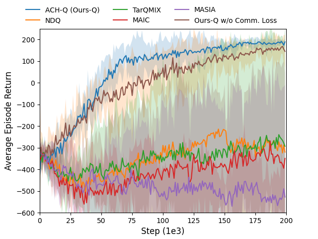

# ACH: Adaptive Communication in Heterogeneous Multi-Agent Reinforcement Learning

This repository is the official implementation of ACH: Adaptive Communication in Heterogeneous Multi-Agent Reinforcement Learning. 

## Requirements

Build the Dockerfile using 
```shell
cd docker
bash build.sh
```

The requirements.txt file can be used to install the necessary packages into a virtual environment.

## Training

The following command train ACH on Predator-Prey

```shell
python3 src/main.py 
--config=ach
--env-config=pp
with
batch_size_run=16
runner="parallel_pp"
```

The following command train ACH on Traiffic Junction

```shell
python3 src/main.py 
--config=ach
--env-config=tj
with
batch_size_run=16
runner="parallel_pp"
```

They are all located in `src/config`.
`--config` refers to the config files in `src/config/algs`
`--env-config` refers to the config files in `src/config/envs`

All results will be stored in the `Results` folder.

## Results

Our model achieves the following performance on Predator-Prey:

Results on a Predator-Prey task where our methods are compared with SOTA comm-MARL approaches.



More results and details are presented in our paper Adaptive Communication in Heterogeneous Multi-Agent Reinforcement Learning.

## Contributing

This codebase is based on  [PyMARL](https://github.com/oxwhirl/pymarl) codebases which are open-sourced.

