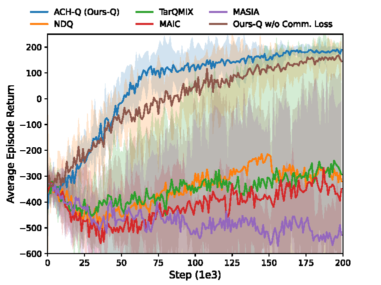

# ACH: Adaptive Communication in Heterogeneous Multi-Agent Reinforcement Learning

This repository is the official implementation of [ACH: Adaptive Communication in Heterogeneous Multi-Agent Reinforcement Learning](https://arxiv.org/abs/2030.12345). 

## Requirements

Build the Dockerfile using 
```shell
cd docker
bash build.sh
```

Set up StarCraft II and SMAC:
```shell
bash install_sc2.sh
```

This will download SC2 into the 3rdparty folder and copy the maps necessary to run over.

The requirements.txt file can be used to install the necessary packages into a virtual environment (not recomended).

## Training

The following command train ACH 

```shell
python3 src/main.py 
--config=ach
--env-config=pp
with
batch_size_run=16
runner="parallel_pp"
```

They are all located in `src/config`.
`--config` refers to the config files in `src/config/algs`
`--env-config` refers to the config files in `src/config/envs`

SMAC maps can be found in src/smac_plus/sc2_maps/.

All results will be stored in the `Results` folder.
## Results

Our model achieves the following performance on :


## Contributing

